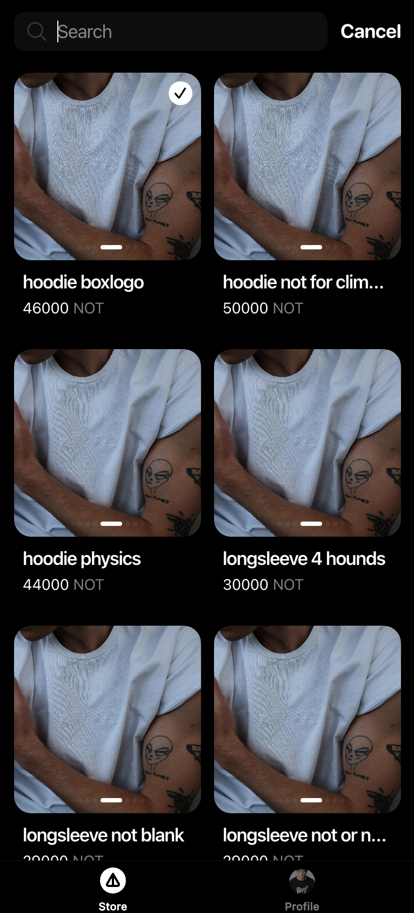
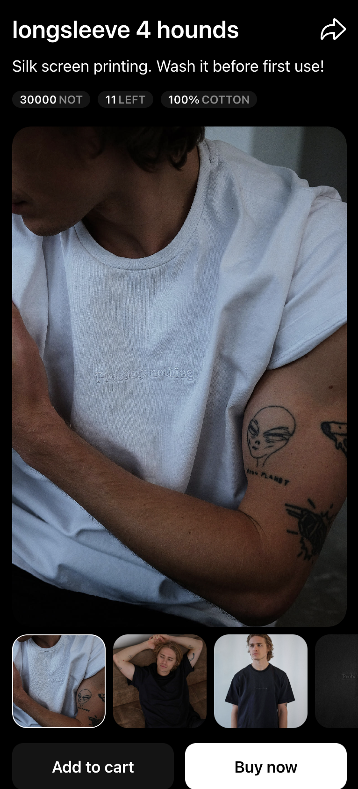
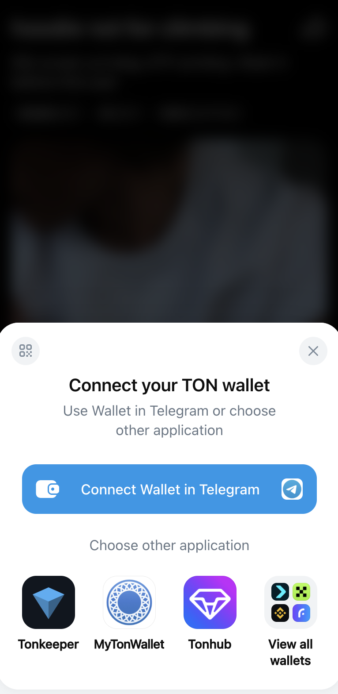
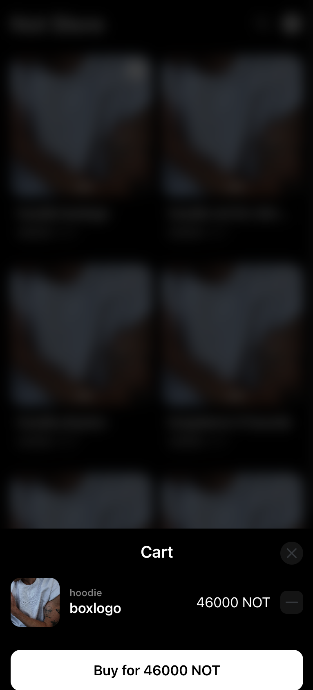
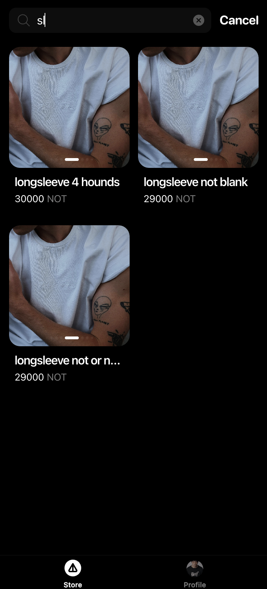
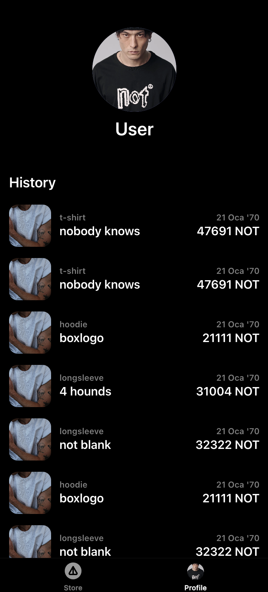

# NotStore for Not Contest

> Pixel-perfect, blockchain-ready e-commerce for Not Contest

[](https://vercel.com/new/clone?repository-url=https://github.com/mikailipek/contest)
[](LICENSE)
[](https://github.com/mikailipek/contest/actions)
[](https://notstore-contest.vercel.app/)


## TL;DR

NotStore for Not Contest is a pixel-perfect e-commerce Telegram Mini App featuring TON Connect blockchain payments, RTK Query optimization, and Figma-faithful UI design.

## 🚀 Live Demo

**📱 Production App:** https://notstore-contest.vercel.app/  
**🤖 Telegram Bot:** http://t.me/notstore_notcontest_bot/not_store  
**👤 Bot Username:** @notstore_notcontest_bot

### Demo Videos & Screenshots

<details>
<summary>📸 View Screenshots & Videos</summary>

| Feature                      | Preview                                           |
| ---------------------------- | ------------------------------------------------- |
| **Main Store**               |          |
| **Product Details**          |  |
| **Buy Now**                  |      |
| **Modal Dialogs**            |               |
| **Search & Filter**          |             |
| **Profile and History**      |           |
| **This style doesn't exist** |        |

**📹 Demo Videos:**

- [Image Blur Loading](docs/ImageBlur.mp4) - Progressive image loading with BlurHash
- [Purchase History](docs/History.mp4) - Transaction history and order tracking
- [Skeleton Loading](docs/Skeleton.mp4) - Loading states and UI placeholders
- [Add to Cart](docs/AddChart.mp4) - Shopping cart functionality
- [Modal Interactions](docs/Modal.mp4) - Modal dialogs and overlays

</details>

## ✨ Features

### 🎨 **UI/UX Excellence**

- **Pixel-Perfect Design**: Figma-faithful implementation with exact spacing and typography
- **Dark/Light/System Themes**: Seamless theme switching with system preference detection
- **Responsive Layout**: Mobile-first design optimized for Telegram Mini App viewport
- **Smooth Animations**: Micro-interactions and transitions for enhanced user experience

### 🛒 **E-commerce Core**

- **Advanced Product Catalog**: Grid/list views with category filtering and sorting
- **Smart Search**: Real-time search with debouncing and result highlighting
- **Shopping Cart**: Persistent cart state with quantity management and price calculations
- **Wishlist System**: Save favorite products with local storage persistence

### 🔗 **Blockchain Integration**

- **TON Connect**: Seamless wallet connection with multiple wallet support
- **Crypto Payments**: Native TON blockchain payment processing
- **Transaction History**: Complete purchase history with blockchain verification
- **Wallet Management**: Multi-wallet support with secure connection handling

### ⚡ **Performance & Optimization**

- **RTK Query Caching**: Intelligent API caching with automatic invalidation
- **Code Splitting**: Route-based lazy loading for optimal bundle sizes
- **Image Optimization**: BlurHash placeholders with progressive loading
- **Virtual Scrolling**: Efficient rendering for large product lists

### 📱 **Telegram Integration**

- **WebApp SDK 2.0**: Full Telegram Mini App API integration
- **Safe Area Support**: Proper handling of device notches and navigation bars 🚧
- **Haptic Feedback**: Native device feedback for user interactions 🚧
- **Theme Synchronization**: Automatic theme matching with Telegram client 🚧

### 🔧 **Developer Experience**

- **TypeScript**: Full type safety with strict mode configuration
- **ESLint + Prettier**: Consistent code formatting and quality checks
- **Husky Hooks**: Pre-commit validation and automated testing
- **Hot Module Replacement**: Instant development feedback with Vite

## 🛠️ Tech Stack

### **Frontend Framework & Core**

- **React 19.1.0** - Latest React with concurrent features
- **TypeScript 5.8.3** - Type-safe development with strict configuration
- **Vite 6.3.5** - Lightning-fast build tool with HMR

### **State Management**

- **Redux Toolkit 2.8.2** - Modern Redux with simplified API
- **RTK Query** - Powerful data fetching and caching solution

### **UI & Styling**

- **React Loading Skeleton** - Elegant loading states
- **BlurHash** - Progressive image loading with blur placeholders

### **Performance & Optimization**

- **React Window** - Virtualized scrolling for large lists
- **Code Splitting** - Route-based lazy loading optimization

### **Blockchain & Payments**

- **TON Connect UI React 2.1.0** - TON blockchain wallet integration

### **Build & Development**

- **ESLint** - Code quality and consistency
- **Prettier** - Automated code formatting
- **Husky** - Git hooks for quality assurance

## 🚀 Quick Start

### Prerequisites

```bash
Node.js ≥ 20.0.0
pnpm ≥ 9.0.0
```

### Installation

```bash
# Clone & Install
git clone https://github.com/mikailipek/contest.git
cd contest
pnpm install

# Environment Setup
cp .env.example .env
# Configure: BOT_TOKEN, VITE_BOT_USERNAME

# Development
pnpm dev          # Start dev server (http://localhost:5173)
pnpm lint         # Check code quality
pnpm build        # Production build
pnpm preview      # Preview build
```

### Available Scripts

| Script      | Description              | Usage            |
| ----------- | ------------------------ | ---------------- |
| `dev`       | Development server       | `pnpm dev`       |
| `build`     | Production build         | `pnpm build`     |
| `build:dev` | Development build        | `pnpm build:dev` |
| `lint`      | ESLint code checking     | `pnpm lint`      |
| `preview`   | Preview production build | `pnpm preview`   |
| `prepare`   | Husky git hooks setup    | `pnpm prepare`   |

## 🔧 Environment Variables

| Variable               | Purpose                            | Example                       | Required | Status     |
| ---------------------- | ---------------------------------- | ----------------------------- | -------- | ---------- |
| `VITE_BOT_TOKEN`       | Telegram bot token from @BotFather | `123456:ABC...`               | ✅       | **In Use** |
| `VITE_APP_TITLE`       | Application title                  | `NotStore for Not Contest`    | ❌       | Defined    |
| `VITE_API_BASE_URL`    | API base URL                       | `https://api.example.com`     | ❌       | Defined    |
| `VITE_APP_NAME`        | Application name                   | `notstore-contest`            | ❌       | Defined    |
| `VITE_APP_DESCRIPTION` | App description                    | `Pixel-perfect e-commerce...` | ❌       | Defined    |
| `VITE_APP_VERSION`     | Application version                | `1.0.0`                       | ❌       | Defined    |
| `NODE_ENV`             | Build environment                  | `production`                  | ❌       | Automatic  |

## 🚀 Deployment

### Deploy to Vercel

[](https://vercel.com/new/clone?repository-url=https://github.com/mikailipek/contest)

The application is already deployed and running at:

- **Production URL:** https://notstore-contest.vercel.app/
- **Bot Integration:** http://t.me/notstore_notcontest_bot/not_store

### Security Configuration

Our `vercel.json` includes optimized Content Security Policy headers for Telegram Mini Apps with proper CSP directives for secure operation.

## 📱 Telegram Bot Setup

### BotFather Configuration

1. **Create Bot**

   ```
   /newbot
   Bot Name: NotStore for Not Contest
   Username: notstore_notcontest_bot
   ```

2. **Set Web App**

   ```
   /newapp
   Select bot: @notstore_notcontest_bot
   URL: https://notstore-contest.vercel.app/
   ```

3. **Configure Menu Button**
   ```
   /setmenubutton
   Select bot: @notstore_notcontest_bot
   URL: https://notstore-contest.vercel.app/
   Text: 🛍️ Open Store
   ```

## 🏗️ Project Structure

```
src/
├── components/          # Reusable UI components
├── features/           # Feature-based modules
│   ├── account/        # User account management
│   ├── cart/          # Shopping cart functionality
│   ├── catalogue/     # Product catalog
│   ├── checkout/      # Checkout process
│   ├── search/        # Search functionality
│   ├── theme/         # Theme management
│   └── tonConnect/    # TON blockchain integration
├── hooks/             # Custom React hooks
├── store/             # Redux store configuration
├── types/             # TypeScript type definitions
└── utils/             # Utility functions
```

## 🤝 Contributing

We welcome contributions! Please see our [Contributing Guidelines](CONTRIBUTING.md) for details.

### Development Workflow

1. Fork the repository
2. Create a feature branch: `git checkout -b feature/amazing-feature`
3. Make your changes with proper TypeScript types
4. Run tests and linting: `pnpm lint`
5. Commit with conventional commits: `git commit -m 'feat: add amazing feature'`
6. Push to your branch: `git push origin feature/amazing-feature`
7. Open a Pull Request

### Code Standards

- **TypeScript**: Strict mode enabled, full type coverage required
- **ESLint**: All rules must pass, no warnings allowed
- **Prettier**: Automatic code formatting on commit
- **Conventional Commits**: Required for all commit messages

## 📄 License

This project is licensed under the MIT License - see the [LICENSE](LICENSE) file for details.

## 🙏 Acknowledgments

- **Not Contest** - For providing the opportunity to build this application
- **TON Foundation** - For the excellent blockchain infrastructure
- **Telegram** - For the innovative Mini App platform
- **Figma Community** - For design inspiration and resources

---

<div align="center">

**Built with ❤️ for Not Contest**

[🚀 Live Demo](https://notstore-contest.vercel.app/) • [🤖 Telegram Bot](http://t.me/notstore_notcontest_bot/not_store) • [📖 Documentation](docs/) • [🐛 Report Bug](https://github.com/mikailipek/contest/issues)

</div>
